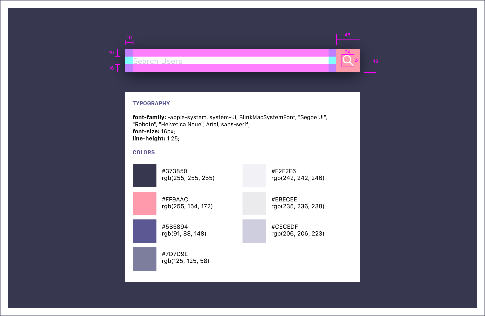
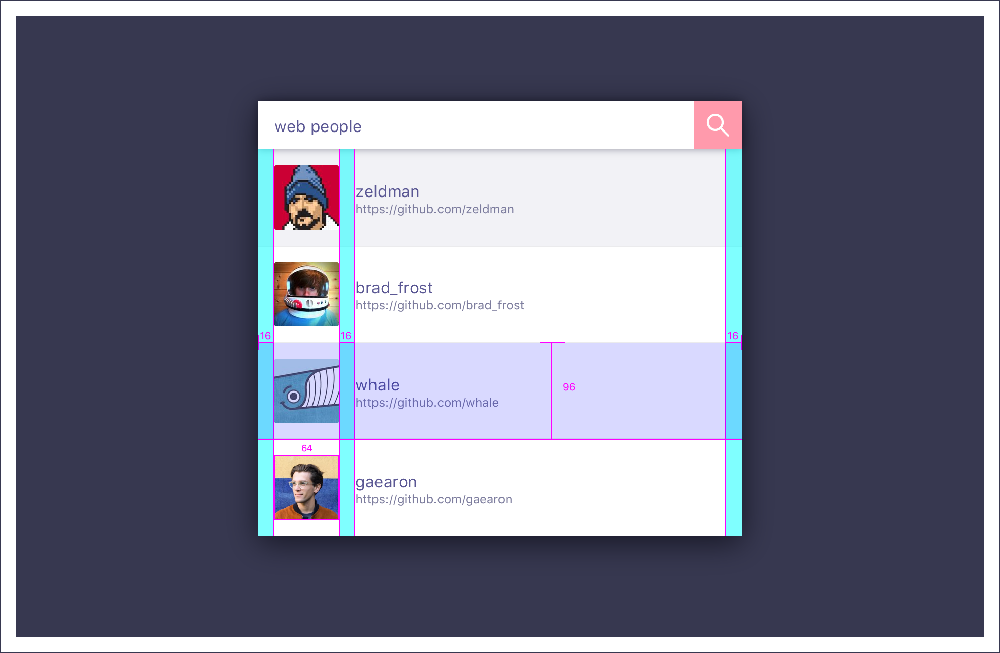

# Front End Interview Quesiton

The assignment is to develop an AutoComplete component for searching Github Users. The assignment has two discrete parts, one focusing on styling, the other on functionality.

## Part I

Given the following design specs and starter files, generate the necessary styles for the UI component's look and feel. It is ok to incorporate any additional tooling, libraries, and/or modify the underlying HTML or React components as needed to achieve the design using your prefered approach.






<br />

---

## Part II

In Part I, the component uses fake data to emulate the functionality of an auto-complete component, for this part we want to integrate with an actual API.

Integrate with the Github v3 REST API for searching Github Users. As one types into the search field, query Github for matching users and populate a list showing the Github User's avatar, login, and link to the User's Github page.

https://developer.github.com/v3/search/#search-users


## About the starter files

This project was bootstrapped with [Create React App](https://github.com/facebookincubator/create-react-app).

Clicking on the search button will toggle between two states, one that has sample results and another without.

To run, first

```
npm install
```

Then

```
npm start
```
